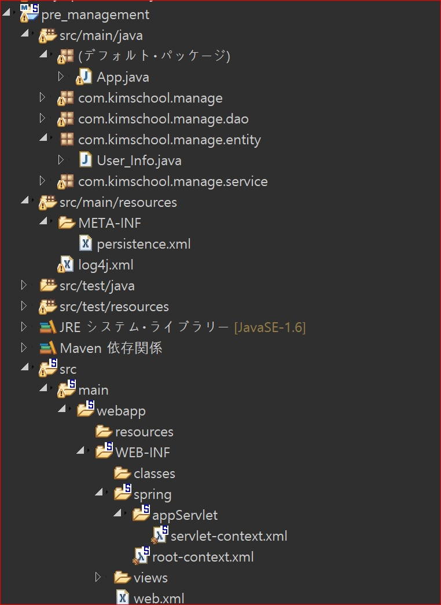

# Source Tree  

  </img>

# About Order  
1. Jpa, Mysql 추가
 

	<pre>
		<dependency>  
			<groupId>org.eclipse.persistence</groupId>  
			<artifactId>org.eclipse.persistence.jpa</artifactId>  
			<version>2.5.2</version>  
		</dependency>  
    
		<dependency>  
		    <groupId>mysql</groupId>  
		    <artifactId>mysql-connector-java</artifactId>  
		    <version>5.1.6</version>  
		</dependency>  
	    </pre>

		
 2. persistence.xml 생성  
 

	<pre>
	 <?xml version="1.0" encoding="UTF-8"?>
		<persistence version="2.1"
			     xmlns="http://xmlns.jcp.org/xml/ns/persistence" xmlns:xsi="http://www.w3.org/2001/XMLSchema-instance"
			     xsi:schemaLocation="http://xmlns.jcp.org/xml/ns/persistence http://xmlns.jcp.org/xml/ns/persistence/persistence_2_1.xsd">
		    <persistence-unit name="db">

		       <properties>
				    <property name="javax.persistence.jdbc.driver" value="com.mysql.jdbc.Driver"></property>
				    <property name="javax.persistence.jdbc.url" value="jdbc:mysql://localhost:3306/test"></property>
				    <property name="javax.persistence.jdbc.user" value="root"></property>
				    <property name="javax.persistence.jdbc.password" value="kimschool1"></property>
			</properties>
		    </persistence-unit>
		</persistence>
	    </pre>

# About Trouble   
git config core.autocrlf true

# 참조 URL  
- About JPQL  
https://victorydntmd.tistory.com/205  

- About Alias  
https://velog.io/@2yeseul/-Spring-boot-Caused-by-org.hibernate.hql.internal.ast.QuerySyntaxException-is-not-mapped-%EC%98%A4%EB%A5%98   

- Youtube  
https://www.youtube.com/watch?v=otinfgwkMbY  
