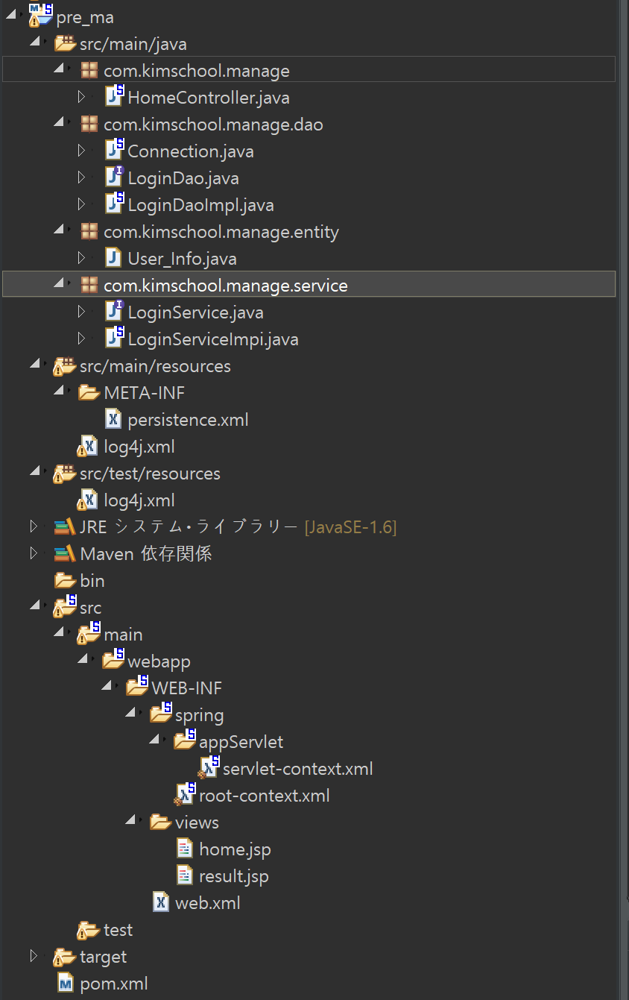

# 구조
<div>	
  </img>	
</div>	

# 폴더별 설명  
Day1 : Jpa연동 직후  
  -youtube URL : https://youtu.be/SQsH1z5rDFQ  
  -과제 : GitHub 생성하기  

Day2 : MVC기본 구조 구축
  -youtube URL : 
  -과제 : result.jsp에 user_info테이블로부터 취득건수 표시 하기

<hr>
# 구성순서

- pom.xml에 dependency추가
```bash
      <dependency>
         <groupId>mysql</groupId>
         <artifactId>mysql-connector-java</artifactId>
         <version>5.1.38</version>
      </dependency>

      <dependency>
         <groupId>org.springframework</groupId>
         <artifactId>spring-jdbc</artifactId>
         <version>3.1.1.RELEASE</version>
      </dependency>
      
      <dependency>
	    <groupId>org.hibernate</groupId>
	    <artifactId>hibernate-core</artifactId>
	    <version>5.4.0.Final</version>
	</dependency>
```

- com.kimschool.manage.dao패키지
1. persistence접속용 Connection생성  

```java
package com.kimschool.manage.dao;

import javax.persistence.EntityManager;
import javax.persistence.EntityManagerFactory;
import javax.persistence.Persistence;

import org.springframework.stereotype.Component;

@Component
public class Connection {
	
	public EntityManager getConnection() {
		EntityManagerFactory emf = Persistence.createEntityManagerFactory("db");
		EntityManager em = emf.createEntityManager();
		return em;
	}
}

```

2. LoginDao인터페이스 생성  
인터페이스? 목차(리스트)의 역활
```bash
package com.kimschool.manage.dao;

public interface LoginDao {

	public int findUser(String id, String password);

}
```


3. LoginDaoImpl 클래스 생성  
Interface? 목차(리스트)를 구현화하는 클레스
```bash
package com.kimschool.manage.dao;

import java.util.List;

import javax.persistence.EntityManager;

import org.springframework.beans.factory.annotation.Autowired;
import org.springframework.stereotype.Repository;

import com.kimschool.manage.entity.User_Info;

@Repository
public class LoginDaoImpl implements LoginDao {
	
	@Autowired
	Connection conn;

	EntityManager em;
	
	
	@Override
	public int findUser(String id, String password) {
		em = conn.getConnection();
		List<User_Info> result = em.createNamedQuery("User_Info.findBypassword", User_Info.class).
				setParameter("password", password).
				setParameter("id", id).
				getResultList();
		
		int size = result.size();
		
		return size;
	}

}

```


# GitHub생성시 유의점
1. fatal: CRLF would be replaced by LF in ...... 에러 발생시
```bash
git config core.autocrlf true
```  
를 cmd 상태에서 입력한다.

# 마크업 작성예
URL : [링크](https://www.makeareadme.com/)
